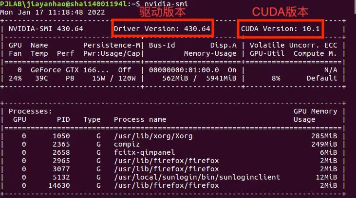

# openmmlab开发文档（一）

## 环境搭建

本文全部基于以下配置进行搭建，建议使用openmmlab系列前对软硬件进行完整测试，全部验证完成后开始你的AI之旅。

演示平台：其中CPU和GPU型号无限制，你可以随意发挥。

<table border="2" style="text-align:center">   
  	<tr>         
        <td>CPU</td>
        <td>Intel i7-11700</td>
    </tr>
  	<tr>         
        <td>GPU</td>
        <td>Nvidia GTX-1660TI</td>
    </tr>
    <tr>
        <td>系统</td>
        <td>Ubuntu 16.04</td>
    </tr>
    <tr>         
        <td>CUDA版本</td>
        <td>10.1</td>
    </tr>
  	<tr>         
        <td>显卡驱动</td>
        <td>430.64</td>
    </tr>
  	<tr>         
        <td>Anaconda版本</td>
        <td>4.5.11</td>
    </tr>
  	<tr>         
        <td>Python版本</td>
        <td>3.7.0</td>
    </tr>
  	<tr>         
        <td>numpy版本</td>
        <td>1.21.5</td>
    </tr>
  	<tr>         
        <td>pytorch版本</td>
        <td>1.8.1</td>
    </tr>
  	<tr>         
        <td>mmcv版本</td>
        <td>1.4.2</td>
    </tr>
</table>

​	Linux系统是AI从业人员和大部分计算机相关方向的主力系统，各类服务器、数据中心、银行系统等都是基于Unix/Linux的定制化。我国为了摆脱对Windows系统的依赖也在逐步进行OS国产化，近些年的deepin系统、chinaredflag-Linux都是如此，因此希望学习AI的老师和同学们未来都可以逐渐适应Ubuntu系统。


## 硬件篇

​	GPU的超大规模并行机制可以对AI领域大量的矩阵运算进行加速，相比于CPU训练可以提速数倍至数十倍，因此我们更推荐使用GPU来进行模型的推理训练。目前国际主要GPU厂家有AMD、Nvidia和即将加入的Intel三家，由于我们的训练需要依赖CUDA环境，所以推荐大家使用Nvidia旗下的显卡，本文档就是基于GTX-1660TI进行演示的（因为AMD的显卡仅支持ROCm框架，CUDA为Nvidia专有，使用AMD显卡无法进行CUDA加速）。

​	CUDA是由Nvidia公司开发的通用计算架构，需要有对应的显卡驱动作为支持。如果没有正确安装CUDA，会导致进行深度学习训练时无法使用GPU进行训练加速。一般的云服务器都会帮用户预装CUDA环境不用担心，检查自己的CUDA和显卡驱动版本可以**使用Ctrl+Alt+T呼出terminal**，输入nvidia-smi命令检查，效果如下图所示。



[CUDA下载地址](https://developer.nvidia.cn/cuda-downloads?target_os=Linux&target_arch=x86_64&Distribution=Ubuntu)

[显卡驱动下载地址](https://www.nvidia.cn/geforce/drivers/)


## 软件篇

### Ubuntu系统配置

​	因为我们安装软件需要使用pip或者conda，但是这两者的下载源地址是国外的路径，速度非常慢，因此我们推荐在开始安装之前先配置好国内的下载源，这里我们推荐使用清华源或中科大源(PS：Mac系统使用M1之后的硬件配置必须使用清华源，因为中科大源的pytorch、numpy、python之间有莫名的引用冲突)。

​	在terminal中输入：

` `

```bash
sudo vim /etc/apt/sources.list
```

​	vim是一种Linux系统下的编辑器，初始进入状态是只读不可编辑。所以进入之后，**按i键切换到编辑模式**，之后将文件内容替换为：

```bash
deb http://mirrors.tuna.tsinghua.edu.cn/ubuntu/ xenial main multiverse restricted universe
deb http://mirrors.tuna.tsinghua.edu.cn/ubuntu/ xenial-backports main multiverse restricted universe
deb http://mirrors.tuna.tsinghua.edu.cn/ubuntu/ xenial-proposed main multiverse restricted universe
deb http://mirrors.tuna.tsinghua.edu.cn/ubuntu/ xenial-security main multiverse restricted universe
deb http://mirrors.tuna.tsinghua.edu.cn/ubuntu/ xenial-updates main multiverse restricted universe
deb-src http://mirrors.tuna.tsinghua.edu.cn/ubuntu/ xenial main multiverse restricted universe
deb-src http://mirrors.tuna.tsinghua.edu.cn/ubuntu/ xenial-backports main multiverse restricted universe
deb-src http://mirrors.tuna.tsinghua.edu.cn/ubuntu/ xenial-proposed main multiverse restricted universe
deb-src http://mirrors.tuna.tsinghua.edu.cn/ubuntu/ xenial-security main multiverse restricted universe
deb-src http://mirrors.tuna.tsinghua.edu.cn/ubuntu/ xenial-updates main multiverse restricted universe
```

​	然后**按Esc按键**退出编辑模式，**按Shift + ‘ : ’ **进入文件编辑命令，**输入wq**保存并退出，最后输入命令，完成更新：

` `

```bash
sudo apt-get update
```


### Anaconda安装

​	Anaconda是一个python的发行版，包括了python和很多常见的软件库, 和一个包管理器conda，我们后续的学习都基于它提供的环境。首先，我们需要**在[清华anaconda镜像源](https://mirrors.tuna.tsinghua.edu.cn/anaconda/archive/)下载**Anaconda的安装包。之后在terminal中输入并**运行.sh文件**

```bash
cd Downloads/
bash Anaconda3-你下载的版本-Linux-x86_64.sh
```

​	在注册信息页面**输入yes**，阅读之后**再输入yes**，之后**按Enter**完成安装，最后**输入yes**将conda添加到环境变量中。在提示信息“Do you wish to proceed with the installation of Microsoft VSCode? [yes|no]”，**输入no**。重启terminal，即可使用Anaconda。

​	最后修改终端的默认 python 为 anaconda，完成Anaconda的安装。

```bash
sudo vim ~/.bashrc
export PATH="/home/xupp/anaconda3/bin:$PATH"
source ~/.bashrc
```

​	同样的我们需要给conda替换下载源，输入命令添加源，具体步骤同上pip换源：

```bash
conda config --add channels https://mirrors.tuna.tsinghua.edu.cn/anaconda/pkgs/free/
conda config --set show_channel_urls yes
```

​	修改配置文件，删除defult路径

```bash
vim ~/.condarc
```

​	修改之后的内容如下：

```shell
channels:
  - https://mirrors.tuna.tsinghua.edu.cn/anaconda/pkgs/free/
show_channel_urls: true
```

​	最后更新源地址结束换源：

```bash
source ~/.condarc
```


### 配置虚拟环境

​	现在我们需要在conda中创建一个新的虚拟环境来方便我们后续的包管理，打开terminal后输入：

```bash
conda create -n openmmlab python==3.9.0
```

​	输入yes之后等待安装完成，然后激活你的新环境开始最后的配置：

```bash
conda activate openmmlab 另:如果后续需要退出环境输入conda deactivate即可
```

在[pytorch官网](https://pytorch.org/get-started/locally/)找到适合自己的版本


​	输入命令安装PyTorch

```bash
pip install  torch==1.8.1+cu101  torchvision==0.9.1+cu101  torchaudio==0.8.1 -f   https://download.pytorch.org/whl/torch_stable.html
```

​	接下来需要验证GPU加速是否成功，**openmmlab环境下**在terminal中**输入python**，然后输入如下代码：

```python
>>import torch
>>print(torch.cuda.is_available())
>>True
>>exit()
```

​	若输出为True则继续进行后续配置，若为False则检查之前的步骤是否正确。


### 安装MMCV

​	mmcv是openmmlab的基础框架，我们可以从[openmmlab开源库](https://github.com/open-mmlab/mmcv)看到相关源代码。如果你的电脑可以使用GPU加速，那么在terminal中输入命令安装mmcv并等待编译完成：

```bash
pip install mmcv-full -f https://download.openmmlab.com/mmcv/dist/cu101/torch1.8.1/index.html
```

​	如果你没有GPU加速计算，那么就安装普通版本的mmcv：

```bash
pip install mmcv
```


### 安装Pycharm

​	我们推荐使用Pycharm来进行Python编程，这是一个强大的Python IDE，可以帮助你高效的阅读和编辑代码。进入[Pycharm官网](https://www.jetbrains.com/pycharm/download/#section=linux)选择安装免费的社区版或专业版（对于新手开发社区版足够）。


​	下载结束后，在terminal中输入以下命令：

```bash
cd Downloads/
tar -zxvf pycharm-community-2021.3.1.tar.gz
cd pycharm-community-2021.3.1/bin/
sh ./pycharm.sh
```

​	同意隐私协议后完成安装。

## 结语

​	至此，所有前期准备工作已经完成，你已经拥有了一台可以用GPU加速的AI编程电脑，让我们开始用AI改变世界吧～
