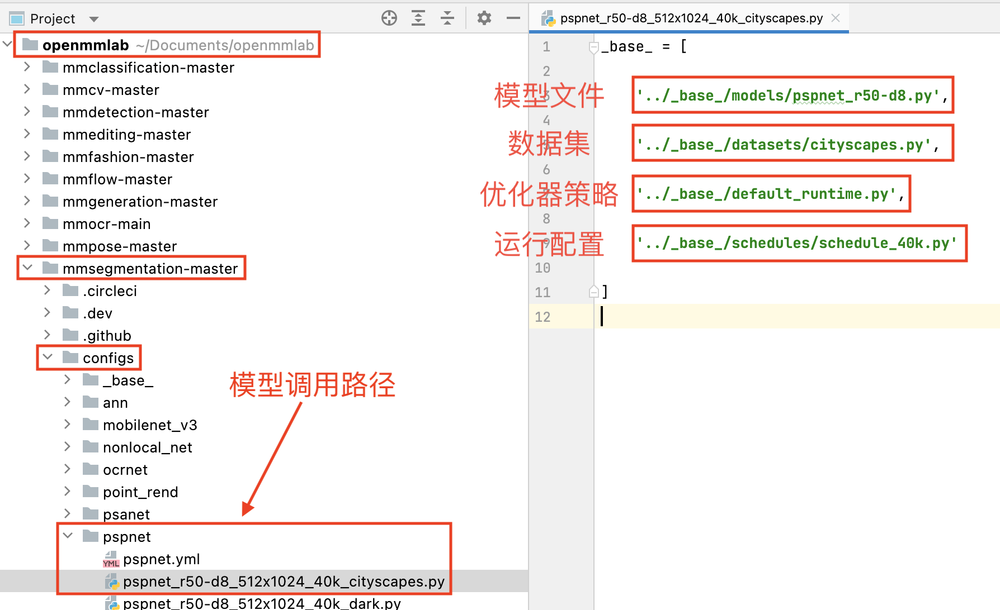
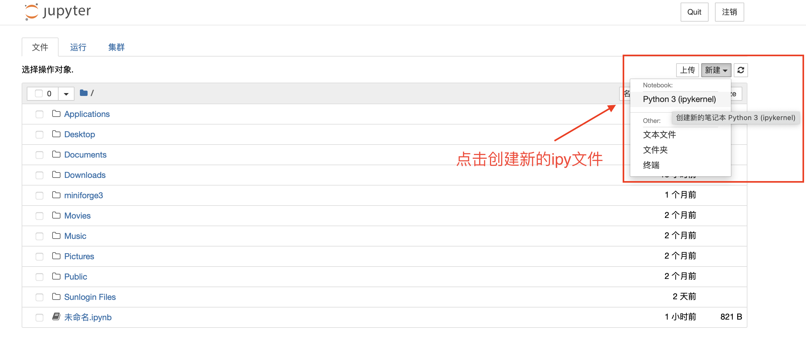
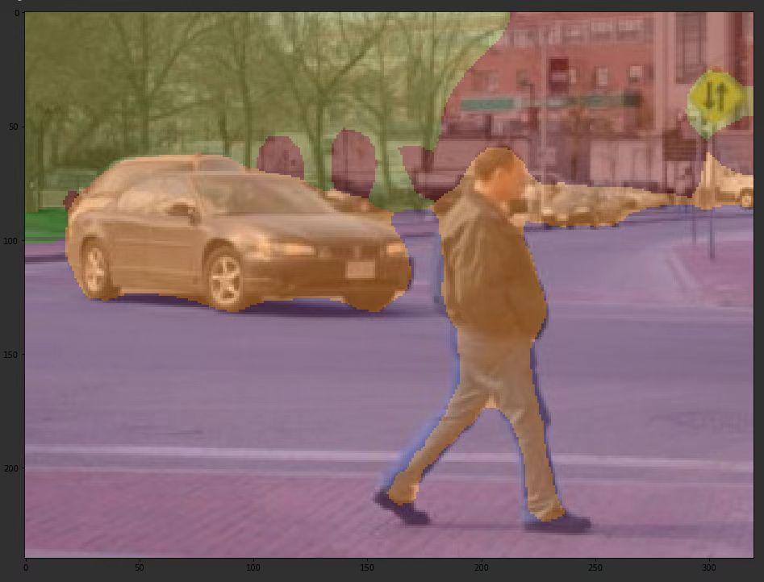

# openmmlab开发文档（四）之MMSegmentaion

----

## 安装教程

​	在使用MMSegmentaion（下文简称mmseg）之前，我们需要配置环境。在第一讲中我们已经配置好了Python、PyTorch和mmcv，这里略过相关信息。接着，我们从GitHub上克隆mmseg代码库并安装。

```bash
git clone http://github.com/open-mmlab/mmsegmentation.git
cd mmsegmentation/
pip install -e .
```

​	安装完成后进入python环境，输入以下代码进行测试

```python
>>import mmseg
>>print(mmseg.__version__)
>>0.20.2
```


## 使用MMSeg预训练模型

​	mmsegmentation/demo下存放了示例图片，我们可以直接使用它来进行测试。

### 准备模型

​	预训练模型通过配置文件和权重参数文件来定义，配置文件定义了模型结构，权重参数文件保存了训练好的模型参数。如图所示，你所选择和使用的模型都已经预先定义好，你可以在mmsegmentation/configs/下查看所有可用的模型，每个模型文件夹内都存放好了该模型对应的结构、数据集、优化器策略和运行配置文件。



​	我们在安装mmseg时就已经将配置文件拿到了本地，但是我们还需要从openmmlab官网手动下载模型权重参数文件。方便起见我们将权重参数文件统一保存在新创建的checkpoints文件夹下并确认正确。

```bash
mkdir ../checkpoints
wget https://download.openmmlab.com/mmsegmentation/v0.5/pspnet/pspnet_r50-d8_512x1024_40k_cityscapes/pspnet_r50-d8_512x1024_40k_cityscapes_20200605_003338-2966598c.pth -P checkpoints
ls configs/pspnet/pspnet_r50-d8_512x1024_40k_cityscapes.py
ls checkpoints/pspnet_r50-d8_512x1024_40k_cityscapes_20200605_003338-2966598c.pth
```


### 构建模型

​	我们在jupyter notebook中进行第一个模型的构建，首先打开terminal，输入ipython notebook，并新建一个ipy文件。



​	在终端编写代码：

```python
from mmseg.apis import init_segmentor, inference_segmentor, show_result_pyplot
from mmseg.core.evaluation import get_palette

config_file = '../configs/deeplabv3/deeplabv3_r50-d8_512x1024_40k_cityscapes.py'
checkpoint_file = '../checkpoints/deeplabv3_r50-d8_512x1024_40k_cityscapes_20200605_022449-acadc2f8.pth'

#如果你的电脑有gpu，则 device = 'cuda:0'，否则使用cpu计算
device = 'cpu'

model = init_model(config_file, checkpoint_file, device = device)
```


接着展示示例图像的分类结果

```python
img = 'demo.png'

result = inference_segmentor(model, img_array)

show_result_pyplot(model, img, result, get_palette('cityscapes')) 
```


## 使用MMSeg_tools训练自己的模型

### 下载数据集

​	这里以iccv2009年的分割数据集作示例，首先需要从斯坦福大学的教育网上下载数据集并解压。

```bash
wget http://dags.stanford.edu/data/iccv09Data.tar.gz -O standford_background.tar.gz
tar xf standford_background.tar.gz
```

​	目录如下图，image包括了原始图片，labels包含了语义分割之后的图片和对应的语义类的标注情况txt，splits包含了训练和测试用的txt，horizons.txt中声明了图像尺寸和基准位置。

​	你也可以自己创建新的数据集并使用mmseg进行训练，需要注意的是**新的数据集格式必须将图像和标签放在同级目录下**，最简单的就是转换成和该数据集相同的格式。


### 修改配置文件

​	为了能够复用不同配置文件中的常用部分，mmseg支持多配置文件继承，下面我们就基于原先的pspnet来自定义一个配置文件。

​	在mmsegmentation/configs/pspnet/pspnet_r50-d8_512x1024_40k_cityscapes.py下修改属于自己的模型文件，示例原图显示如下。

```python
import mmcv
import matplotlib.pyplot as plt

img = mmcv.imread('iccv09Data/images/6000124.jpg')
plt.figure(figsize=(8, 6))
plt.imshow(mmcv.bgr2rgb(img))
plt.show()
```


```python
import os.path as osp
import numpy as np
from PIL import Image
# convert dataset annotation to semantic segmentation map
data_root = 'iccv09Data'
img_dir = 'images'
ann_dir = 'labels'
# define class and plaette for better visualization
classes = ('sky', 'tree', 'road', 'grass', 'water', 'bldg', 'mntn', 'fg obj')
palette = [[128, 128, 128], [129, 127, 38], [120, 69, 125], [53, 125, 34], 
           [0, 11, 123], [118, 20, 12], [122, 81, 25], [241, 134, 51]]
for file in mmcv.scandir(osp.join(data_root, ann_dir), suffix='.regions.txt'):
  seg_map = np.loadtxt(osp.join(data_root, ann_dir, file)).astype(np.uint8)
  seg_img = Image.fromarray(seg_map).convert('P')
  seg_img.putpalette(np.array(palette, dtype=np.uint8))
  seg_img.save(osp.join(data_root, ann_dir, file.replace('.regions.txt', 
                                                         '.png')))
```

​	

```python
# Let's take a look at the segmentation map we got
import matplotlib.patches as mpatches
img = Image.open('iccv09Data/labels/6000124.png')
plt.figure(figsize=(8, 6))
im = plt.imshow(np.array(img.convert('RGB')))

# create a patch (proxy artist) for every color 
patches = [mpatches.Patch(color=np.array(palette[i])/255., 
                          label=classes[i]) for i in range(8)]
# put those patched as legend-handles into the legend
plt.legend(handles=patches, bbox_to_anchor=(1.05, 1), loc=2, borderaxespad=0., 
           fontsize='large')

plt.show()
```

​	


```python
# split train/val set randomly
split_dir = 'splits'
mmcv.mkdir_or_exist(osp.join(data_root, split_dir))
filename_list = [osp.splitext(filename)[0] for filename in mmcv.scandir(
    osp.join(data_root, ann_dir), suffix='.png')]
with open(osp.join(data_root, split_dir, 'train.txt'), 'w') as f:
  # select first 4/5 as train set
  train_length = int(len(filename_list)*4/5)
  f.writelines(line + '\n' for line in filename_list[:train_length])
with open(osp.join(data_root, split_dir, 'val.txt'), 'w') as f:
  # select last 1/5 as train set
  f.writelines(line + '\n' for line in filename_list[train_length:])
```

​	

```python
from mmseg.datasets.builder import DATASETS
from mmseg.datasets.custom import CustomDataset

@DATASETS.register_module()
class StandfordBackgroundDataset(CustomDataset):
  CLASSES = classes
  PALETTE = palette
  def __init__(self, split, **kwargs):
    super().__init__(img_suffix='.jpg', seg_map_suffix='.png', 
                     split=split, **kwargs)
    assert osp.exists(self.img_dir) and self.split is not None
    
```

​	

```python
from mmcv import Config
cfg = Config.fromfile('../configs/pspnet/pspnet_r50-d8_512x1024_40k_cityscapes.py')
```

​	

```python
from mmseg.apis import set_random_seed

# Since we use ony one GPU, BN is used instead of SyncBN
cfg.norm_cfg = dict(type='BN', requires_grad=True)
cfg.model.backbone.norm_cfg = cfg.norm_cfg
cfg.model.decode_head.norm_cfg = cfg.norm_cfg
cfg.model.auxiliary_head.norm_cfg = cfg.norm_cfg
# modify num classes of the model in decode/auxiliary head
cfg.model.decode_head.num_classes = 8
cfg.model.auxiliary_head.num_classes = 8

# Modify dataset type and path
cfg.dataset_type = 'StandfordBackgroundDataset'
cfg.data_root = data_root

cfg.data.samples_per_gpu = 8
cfg.data.workers_per_gpu=8

cfg.img_norm_cfg = dict(
    mean=[123.675, 116.28, 103.53], std=[58.395, 57.12, 57.375], to_rgb=True)
cfg.crop_size = (256, 256)
cfg.train_pipeline = [
    dict(type='LoadImageFromFile'),
    dict(type='LoadAnnotations'),
    dict(type='Resize', img_scale=(320, 240), ratio_range=(0.5, 2.0)),
    dict(type='RandomCrop', crop_size=cfg.crop_size, cat_max_ratio=0.75),
    dict(type='RandomFlip', flip_ratio=0.5),
    dict(type='PhotoMetricDistortion'),
    dict(type='Normalize', **cfg.img_norm_cfg),
    dict(type='Pad', size=cfg.crop_size, pad_val=0, seg_pad_val=255),
    dict(type='DefaultFormatBundle'),
    dict(type='Collect', keys=['img', 'gt_semantic_seg']),
]

cfg.test_pipeline = [
    dict(type='LoadImageFromFile'),
    dict(
        type='MultiScaleFlipAug',
        img_scale=(320, 240),
        # img_ratios=[0.5, 0.75, 1.0, 1.25, 1.5, 1.75],
        flip=False,
        transforms=[
            dict(type='Resize', keep_ratio=True),
            dict(type='RandomFlip'),
            dict(type='Normalize', **cfg.img_norm_cfg),
            dict(type='ImageToTensor', keys=['img']),
            dict(type='Collect', keys=['img']),
        ])
]


cfg.data.train.type = cfg.dataset_type
cfg.data.train.data_root = cfg.data_root
cfg.data.train.img_dir = img_dir
cfg.data.train.ann_dir = ann_dir
cfg.data.train.pipeline = cfg.train_pipeline
cfg.data.train.split = 'splits/train.txt'

cfg.data.val.type = cfg.dataset_type
cfg.data.val.data_root = cfg.data_root
cfg.data.val.img_dir = img_dir
cfg.data.val.ann_dir = ann_dir
cfg.data.val.pipeline = cfg.test_pipeline
cfg.data.val.split = 'splits/val.txt'

cfg.data.test.type = cfg.dataset_type
cfg.data.test.data_root = cfg.data_root
cfg.data.test.img_dir = img_dir
cfg.data.test.ann_dir = ann_dir
cfg.data.test.pipeline = cfg.test_pipeline
cfg.data.test.split = 'splits/val.txt'

# We can still use the pre-trained Mask RCNN model though we do not need to
# use the mask branch
cfg.load_from = '../checkpoints/pspnet_r50-d8_512x1024_40k_cityscapes_20200605_003338-2966598c.pth'

# Set up working dir to save files and logs.
cfg.work_dir = './work_dirs/tutorial'

cfg.runner.max_iters = 200
cfg.log_config.interval = 10
cfg.evaluation.interval = 200
cfg.checkpoint_config.interval = 200

# Set seed to facitate reproducing the result
cfg.seed = 0
set_random_seed(0, deterministic=False)
cfg.gpu_ids = range(1)

# Let's have a look at the final config used for training
print(f'Config:\n{cfg.pretty_text}')
```

​	

```python
from mmseg.datasets import build_dataset
from mmseg.models import build_segmentor
from mmseg.apis import train_segmentor


# Build the dataset
datasets = [build_dataset(cfg.data.train)]

# Build the detector
model = build_segmentor(
    cfg.model, train_cfg=cfg.get('train_cfg'), test_cfg=cfg.get('test_cfg'))
# Add an attribute for visualization convenience
model.CLASSES = datasets[0].CLASSES

# Create work_dir
mmcv.mkdir_or_exist(osp.abspath(cfg.work_dir))
train_segmentor(model, datasets, cfg, distributed=False, validate=True, 
                meta=dict())
```

​	

### 推理计算

```python
img = mmcv.imread('iccv09Data/images/6000124.jpg')

model.cfg = cfg
result = inference_segmentor(model, img)
plt.figure(figsize=(8, 6))
show_result_pyplot(model, img, result, palette)
```

最终训练结果如图：



## 结语

​	至此，mmseg的预训练和自主训练模型的全部教学就结束了。相对于TensorFlow、PyTorch等深度学习框架，openmmlab的封装更高效简洁，非常适合用于教学任务、敏捷开发、迁移开发和新手入门等方面，希望我们的努力可以帮助你更好地接触AI、使用AI、创造AI。

