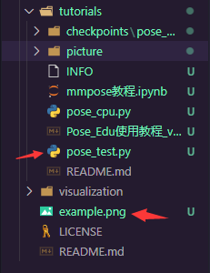

[TOC]

# Pose_Edu使用教程

### Pose_Edu简介

​		Pose_Edu是MMEdu团队在基于OpenMMlab项目的MMPose模块研发的教育版工具，在实现MMPose原始功能的基础上，框架更加简单，结构更加清晰，使用难度也随之降低，适用于课程教学、敏捷开发、迁移开发和新手入门。

​		主要功能：对图片或视频中的人体进行姿态分析，侦测出人体的位置并且对于关键点部位例如五官和关节进行识别，以此来绘制人体的姿态。

    
     
    

      使用Pose_Edu进行推理的结果图
  	

### Pose_Edu安装流程

首先确保您的电脑相关环境配置符合要求：

~~~shell
python==3.9.7 
numpy==1.22.2 
torch==1.8.1+cu101 # cpu环境只需保证torch==1.8.1
torchvision==0.9.1 
torchaudio==0.8.1
mmcv-full==1.4.5 
mmdet==2.21.0 
~~~

#### 安装mmpose及其相关依赖库

- 相关库及其版本如下，其中**ipython**是使用Pose_Edu进行推理显示结果时所需要的模块

其实mmcls,mmgen是非必须安装的模块 ,但是由于我们需要导入MMEdu，所以需要对其代码内容中涉及到的mm模块进行安装，如您已安装，则可忽略。

~~~txt
mmcls==0.20.1 
mmpose==0.23.0
mmgen
ipython
~~~

- 安装方法1

~~~shell
# pip install  {module_name}=={version} -i https://pypi.tuna.tsinghua.edu.cn/simple/
# 例如:
pip install numpy==1.22.2 mmcv==1.4.5 mmdet==2.21.0 mmcls==0.20.1 mmpose==0.23.0 mmgen ipython -i https://pypi.tuna.tsinghua.edu.cn/simple/
#这里将所有的模块和对应的版本号复制到一行中使用清华源进行安装
~~~

- 安装方法2

在当前目录下新建一个文本文档，命名为`requirements.txt`(如果没有设置显示文件扩展名的话命名为`requirements`即可)。

将上面模块及版本信息复制进`requirements.txt`文件中并保存，执行如下命令。

~~~shell
pip install -r requirements -i https://pypi.tuna.tsinghua.edu.cn/simple/
~~~

好了，到目前为止，mmpose的环境已经全部配置完成了，接下来就可以开始模型的推理及训练了。

### Pose_Edu使用说明

#### 1.直接推理（支持CPU）

如果想快速上手体验Pose_Edu的话，我们建议您准备一张有人体姿态的图片或者使用我们自带的图片去进行单独的推理。

在运行下列代码之前，请访问[SCNet模型下载地址](https://download.openmmlab.com/mmpose/top_down/scnet/scnet50_coco_256x192-6920f829_20200709.pth)和[Faster_RCNN模型下载地址](https://download.openmmlab.com/mmdetection/v2.0/faster_rcnn/faster_rcnn_r50_fpn_1x_coco/faster_rcnn_r50_fpn_1x_coco_20200130-047c8118.pth)进行模型的下载并分别放置于如下文件夹中。

**SCNet**:

**OPENMMLAB-EDU**
**├─MMEdu**
**│  ├─models**
**│  │  ├─SCNet**

**Faster_RCNN**: 

**OPENMMLAB-EDU**
**├─MMEdu**
**│  ├─models**
**│  │  ├─FasterRCNN-pose**

执行代码如下:

~~~python
from MMEdu.MMPose_Edu import MMPose #导入mmpose模块

img = '../demo/000000000785.jpg' # 指定进行推理的图片路径，我们使用demo文件夹中提供的图片
model = MMPose(backbone='SCNet') # 实例化mmpose模型
model.inference(img=img,device='cpu') # 在CPU上进行推理
~~~

运行结果如图：

    
     
    

      直接推理的运行结果图
  	

接下来对为您讲述代码规则

- **图片准备**：

~~~python
img = '../demo/000000000785.jpg' # 指定推理图片的路径，这里使用相对路径，先../返回上级目录  然后进入上级目录中的demo文件夹中选择图片
~~~

如果使用自己的图片的话，只需要修改img的路径即可（绝对路径和相对路径均可）

- **实例化模型**：

~~~python
model = MMPose(backbone='SCNet') # 实例化mmpose模型
~~~

这里对于`MMPose`模型提供的参数进行解释，`MMPose`支持传入三个参数：分别是`backbone_det`、`backbone`和`dataset_path`。

`backbone_det`：指定使用的MMDetection模型，默认参数是`'FasterRCNN-pose'`，因为在进行姿态分析前需要检测出人体的位置，需要涉及到MMDetection的使用，我们这里不指定则是默认使用`'FasterRCNN-pose'`。

`backbone`：指定使用的MMPose模型，默认参数是`'HrNet32'`，我们在上述代码中举的例子是`backbone = 'SCNet'`，这里是为了让读者能够学会使用不同的模型进行推理或者训练。

`dataset_path`：指定训练集的路径，默认参数是`None`，因为我们现在是进行推理，不用在训练集上进行训练，所以暂不指定，后面用到时会详细介绍。

- **模型推理**：

~~~python
model.inference(img=img,device='cpu') # 在cpu上进行推理
~~~

将所需要推理图片的路径传入`inference`函数中即可进行推理，我们这里传入了两个参数，`img`代表的就是推理图片的路径，`device`是推理所用的设备，默认是参数是`'cuda:0'`，使用GPU，我们这里将其赋值为`'cpu'`，给设备不支持GPU的同学做一个参考。

在Pose_Edu中对于`inference`函数还有其他的传入参数，在这里进行说明：

`show`：布尔值，默认为`True`，表示推理后是否显示推理结果。

`save`：布尔值，默认为`True`，表示对于推理的结果图片是否保存到本地。

`word_dir`：推理结果图片的保存路径，默认参数为`'./'`即当前目录下，用户可在函数中设置该参数来调整图片的保存路径。

`name`：保存的图片名，数据结构为字符串，默认参数为`'pose_result'`，用户也可以定义为自己想要的名字。

**举个例子：**

~~~python
model.inference(img=img,device='cpu',show=False,save=True,work_dir='../',name='example')
~~~

这一串代码就表示，对于推理结果不进行显示，但是会保存下来，并且对于保存的文件夹路径，这里我使用`'../'`保存到代码文件的上一级目录中，对于文件保存名，这里设置为`'example'`，这里对于保存结果的名字不建议设置为中文，因为系统语言编码的问题很有可能产生乱码。

    
     
    

      保存路径对比
  	

这里我展示一下推理后的路径，其中`pose_test.py`是我的代码文件，`example.png`是推理结果图，可以看到，`example.png`在我的代码文件的外部路径中。

- **结果分析：**

我们这里对于模型推理得到的数据进行查看并且分析，所以用`result`变量进行接受。

~~~python
result = model.inference(img=img,device='cpu') # 在CPU上进行推理并获取结果
print(result)  # 将结果输出进行分析
~~~

**result:**

~~~python
[{'bbox': array([284.62592  ,  50.28537  , 499.4699   , 388.71228  ,   0.9994673],dtype=float32), 
  'keypoints': 
  array([[367.68756   ,  79.1234    ,   0.93220794], # 鼻子
       [374.31696   ,  72.49397   ,   0.93803287], # 右眼
       [361.0581    ,  72.49397   ,   0.94803464], # 左眼
       [387.5758    ,  75.8087    ,   0.9393976 ], # 右耳
       [354.42865   ,  79.1234    ,   0.92077553], # 左耳
       [407.4641    , 115.58528   ,   0.8720494 ], # 右肩
       [364.3728    , 125.529434  ,   0.8965319 ], # 左肩
       [447.24072   , 155.36186   ,   0.6894964 ], # 右肘
       [341.1698    , 161.99132   ,   0.9083003 ], # 左肘
       [443.92596   , 161.99132   ,   0.82263374], # 右手
       [304.70795   , 178.56487   ,   0.94386667], # 左手
       [430.6671    , 211.71202   ,   0.84674084], # 右腿
       [404.1494    , 215.02675   ,   0.84665537], # 左腿
       [430.6671    , 291.2652    ,   0.88470304], # 右膝
       [371.00226   , 271.37695   ,   0.9370589 ], # 左膝
       [473.75842   , 360.87427   ,   0.83864164], # 右脚
       [404.1494    , 340.98596   ,   0.9024544 ]  # 左脚
        ], dtype=float32)}]
~~~

`result`是一个列表，里面会有若干个字典，取决于图片中所识别出的人体个数，因为这个图片中只有一个人，所以列表的长度为1，那么对于每个字典，里面会有两个键值对，分别是`'bbox'`和`'keypoints'`，`'bbox'`中有五个数值，前面四个代表的是图中检测人体的方框位置，第五个数是检测框的置信度；`keypoints`中有若干个检测点，每个检测点中有三个数值，前两个代表该检测点的坐标，最后一个数代表该监测点的置信度。我们可以对比图片看一下。

    
     
    

      对比结果图片与训练数据
  	

对于检测结果，由于原生数据比较复杂，我们不建议大家在控制台进行`print`来查看，但为了大家更好地理解数据，我们在文档中提供一个`my_process`函数，能够对`result`数据进行处理，简单的判断人体双臂是否张开，感兴趣的同学可以查看函数内容并且执行代码输出结果。同时我们也鼓励大家能够发挥自己的想象力，多多思考这一串数字能够有什么其他的应用，锻炼大家的动手能力。

**my_process函数代码**

~~~python
def my_process(pose_results):
    if pose_results == []:
        print("抱歉，未检测出人体")
        return

    # 将得到的三个点进行计算，返回角度
    def process_point(shoulder, elbow, leg):
        vec_1 = elbow - shoulder
        vec_2 = leg - shoulder
        l1 = np.sqrt(vec_1.dot(vec_1))
        l2 = np.sqrt(vec_2.dot(vec_2))
        cos_angel1 = vec_1.dot(vec_2) / (l1 * l2)
        angel = np.arccos(cos_angel1) / np.pi * 180
        return angel

    def get_angel(keypoints):
        # 对于关键点进行分析 得到手臂张开的角度
        left_shoulder = keypoints[6]  # 左肩
        left_elbow = keypoints[8]  # 左肘
        left_leg = keypoints[12]  # 左腿
        right_shoulder = keypoints[5]  # 右肩
        right_elbow = keypoints[7]  # 右肘
        right_leg = keypoints[11]  # 右腿

        # 计算得到左臂张开角度
        left_angel = process_point(left_shoulder, left_elbow, left_leg)

        # 计算得到右臂张开角度
        right_angel = process_point(left_shoulder, left_elbow, left_leg)

        return left_angel, right_angel

    # 对pose_results中的数据进行分析
    people_nums = len(pose_results)
    print('图中检测出的人体数：', people_nums, end='\n\n')
    # 数据处理
    conditions = ['未张开', '张开']

    for index, people in enumerate(pose_results):
        print("第{}位检测的人: ".format(index + 1))
        # 方框坐标

        # 筛选出所有关键点全部检测到的人体
        if len(list(people['keypoints'])) < 17:
            print('抱歉:改检测框中关键点个数不足')
            continue

        
        bbox = list(np.round(people['bbox'][:4], 2))
        print("检测框位置: ", bbox)
        # 得到关键点坐标
        keypoints = np.round(people['keypoints'][:, :2], 2)
        angel1, angel2 = get_angel(keypoints)
        print("双臂张开角度分别为：", '%.2f' % angel1, '%.2f' % angel2)
        condition = conditions[
            1] if angel1 > 30 and angel2 > 30 else conditions[0]
        print('双臂状态判定为：', condition, end='\n\n')

~~~

接着使用下列代码即可查看推理结果分析。

~~~python
result = model.inference(img=img,device='cpu',show=False) # 进行简单推理
my_process(result) # 对结果进行处理分析
~~~

    
     
    

      推理分析result的结果图
  	

#### 2.训练模型

使用下面的代码即可简单体验Pose_Edu的训练过程，我们会为您进行详细的介绍。

在运行代码之前，您需要下载[HrNet32模型](https://download.openmmlab.com/mmdetection/v2.0/faster_rcnn/faster_rcnn_r50_fpn_1x_coco/faster_rcnn_r50_fpn_1x_coco_20200130-047c8118.pth)以及[coco_tiny数据集](https://openmmlab.oss-cn-hangzhou.aliyuncs.com/mmpose/datasets/coco_tiny.tar)。

下载好模型后，需要将模型文件放置于如下所示的目录中。

**OPENMMLAB-EDU**
**├─MMEdu**
**│  ├─models**
**│  │  ├─HrNet32**

对于数据集，解压之后会得到coco_tiny数据集的文件夹，（解压时注意会不会产生重复的coco_tiny文件夹），将整个文件夹放置于`OpenMMLab-Edu\dataset`文件夹中，最后**确保你的文件路径是如下形式**：

**OPENMMLAB-EDU**
**├─dataset**
**│  └─coco_tiny**
**│      └─images**

**coco_tiny**文件夹中包含一个`images`文件夹和两个`.json`文件，分别是`train.json`和`val.json`。`images`文件夹中存储着数据集中的图片，图片格式为`.jpg`；`train.json`和`val.json`文件中包含着数据集的四类文件信息，分别是`"image_file"`、`"image_size"`、`"bbox"`和`"keypoints"`，在这里做一个简单解释。

`"image_file"`：数据结构为字符串，存储的是图片名称。

`"image_size"`：数据结构为列表，长度为2，存储的是图片的宽度和高度：

`"bbox"`：数据结构为列表，长度为4，存储检测框的坐标。

`"keypoints"`：数据结构为列表，存储该检测框中关键点的信息。

- 代码展示

~~~python
DATASET_PATH = '../dataset/coco_tiny' # 指定训练数据集的路径
model = MMPose() # 实例化模型，不指定参数即使用默认参数。
model.load_dataset(path=DATASET_PATH) # 从指定数据集路径中加载数据
model.train(epochs=10, validate=True) # 设定训练的epoch次数以及是否进行评估
~~~

**详细说明**

实例化模型的代码在前面说过就不再赘述。

- 加载数据集：

~~~python
model.load_dataset(path=DATASET_PATH) # 从指定数据集路径中加载数据
~~~

这个函数只需要传入一个`path`参数即训练数据集的路径，函数的作用是修改模型中关于数据集路径的配置文件，从而确保我们在训练时不会找错文件。

这里补充一点：

~~~python
model = MMPose() # 实例化模型，不指定参数即使用默认参数。
model.load_dataset(path=DATASET_PATH) # 从指定数据集路径中加载数据
~~~

上面两行代码和`model = MMPose(dataset_path=DATASET_PATH)`这一行代码所实现的结果是一样的。

而我们设置不同的函数和接口实现这个功能是为了确保适用于不同的场景，比如说`model = MMPose(dataset_path=DATASET_PATH)`这行代码只能在模型的初始化阶段指定数据集路径，而`model.load_dataset(path=DATASET_PATH)`可以在模型初始化之后的任何阶段进行修改，比如我可以先用coco_tiny进行一个阶段的训练，然后更换为其他数据集进行下一轮训练。

- 模型训练

~~~python
model.train(epochs=10, validate=True) # 设定训练的epoch次数以及是否进行评估
~~~

其实这一部分的参数比较多，我先解释一些好理解的以及常用的参数。

`epochs`：默认参数为`100`，用于指定训练的轮次，而在上述代码中我们设置为`10`。

`validate`：布尔值，只能为`True`或者`False`，默认参数为`True`，在训练结束后，设定是否需要在校验集上进行评估，`True`则是需要进行评估。

`lr`：学习率，默认参数为`5e-4`即`0.0005`，指定模型进行梯度下降时的步长。简单解释就是，学习率过小，训练过程会很缓慢，学习率过大时，模型精度会降低。

`save_fold`：模型的保存路径，默认参数为`./checkpoints/pose_model/`，如果不想模型保存在该目录下，可自己指定路径。

`optimizer`：进行迭代时的优化器，默认参数为`Adam`，`Adam`会在训练的过程中动态调整学习率，避免学习率过小或过大。

`distributed`：布尔值，只能为`True`或者`False`，默认参数为`False`，设为`True`时即使用分布式训练。

`metric`：验证指标，默认参数为`'PCK'`，在进行模型评估时会计算`PCK`数值，数值越高说明模型性能越好，我们在运行完程序之后也会看到这个结果。

`random_seed`：随机种子策略，默认为`0`即不使用，使用随机种子策略会减小模型算法结果的随机性。

`save_best`：默认参数为`PCK`，它会选择一个最佳的评估检查点去保存模型。

执行上述代码之后的运行结果如下图

    
     
    

      训练模型控制台输出结果
  	

而在`checkpoints\pose_model`文件夹中我们会发现多了两种文件，一个是`None.log.json`文件，它记录了我们模型在训练过程中的一些参数，比如说学习率`lr`，所用时间`time`，以及损失`loss`等；另一个文件是.pth文件，这个是我们在训练过程中所保存的模型。

#### 3.使用自己训练的模型进行推理

这一步像是把推理和训练结合到了一起，首先**确保你进行了推理和训练的准备工作**，并且使用训练的代码在本地保存了一个模型。

然后可以运行下面的代码，去查看模型的推理结果。

~~~python
img = '../demo/000000196141.jpg' # 指定推理的图片路径
model = MMPose(backbone='SCNet') # 初始化模型
model.inference(is_trained=True,
                pretrain_model='./checkpoints/pose_model/latest.pth',
                img=img) # 进行推理
~~~

在这里，我们重点介绍`inference`这个函数的其他参数，可以看到和[直接推理](####1.直接推理)这一步的代码相比，`inference`中多了两个没见过的参数，分别是`is_trained`和`pretrain_model`，`is_trained`是一个布尔值，为`True`时代表从本地训练过的模型中进行推理，而`is_trained`设置为True之后则需要指定加载模型的路径，这也就是`pretrain_model`这个参数的作用，我们会从`pretrain_model`中加载模型进行推理，然后展示推理结果（如下图）。

    
     
    

      使用本体训练模型推理结果
  	

#### 4.继续训练

在这一步中，我们会教您加载之前训练过的模型接着训练，如果您觉得之前训练的模型epoch数不够的话或者因为一些客观原因而不得不提前结束训练，相信下面的代码会帮到您。

~~~python
model = MMPose(backbone='HrNet32') # 初始化实例模型
model.load_dataset(path=DATASET_PATH) # 配置数据集路径
model.save_fold = "checkpoints/pose_model/" # 设置模型的保存路径
model.train(epochs=15,
            checkpoint='./checkpoints/pose_model/latest.pth',
            validate=True) # 进行再训练
~~~

这里我们有一个参数在之前的[训练模型](####2.训练模型)过程中没有提及，那就是`train`函数中的`checkpoint`参数，这个放到这里就比较好理解，它的意思是指定需要进行再训练的模型路径，当然你也可以根据你需要训练的不同模型而调整参数。

