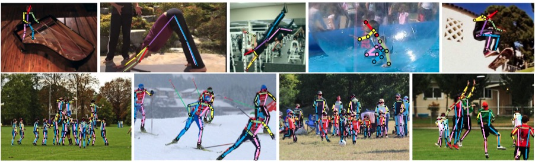
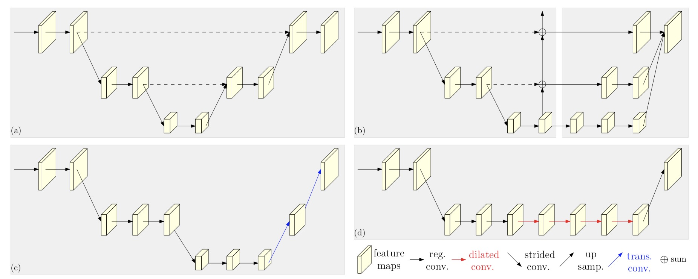
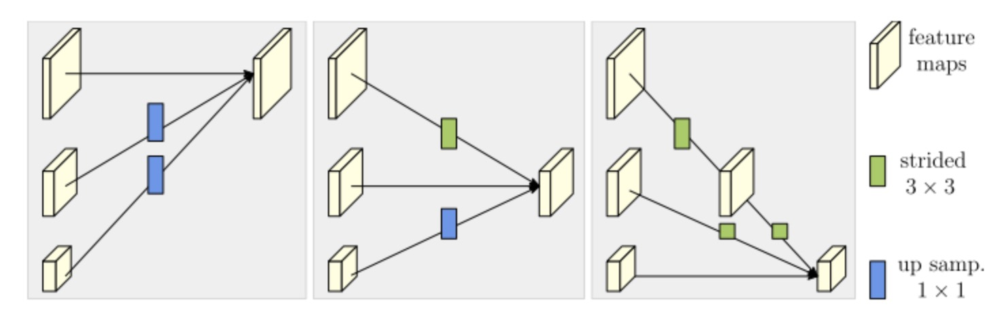

# HrNet说明文档

> [Deep High-Resolution Representation Learning for Human Pose Estimation](https://arxiv.org/pdf/1902.09212.pdf)

## 简介

在人体姿态估计，即关键点检测，旨在从一个图像的大小W×H×3检测K个关键点或部分的位置(例如,手肘、手腕等)。需要生成一个高分辨率的heatmap来进行关键点检测。这就与一般的网络结构比如VGGNet的要求不同，因为VGGNet最终得到的feature map分辨率很低，损失了空间结构。现有的大多数方法都是从高分辨率到低分辨率网络(high-to-low resolution network)产生的低分辨率表征中恢复高分辨率表征。HrNet网络能在整个过程中都保持高分辨率的表征。从高分辨率子网络(high-resolution subnetwork)作为第一阶段开始，逐步增加高分辨率到低分辨率的子网，形成更多的阶段，并将多分辨率子网并行连接。同时使用多次多尺度融合(multi-scale fusions)，使得每一个高分辨率到低分辨率的表征都从其他并行表示中反复接收信息，从而得到丰富的高分辨率表征。因此，预测的关键点热图可能更准确，在空间上也更精确。


## 特点：不同分辨率并联交互
普通网络的结构：将high-to-low resolution subnetworks串联起来，每个子网形成一个阶段，其由序列卷积组成；同时相邻子网之间存在一个下采样层，以将分辨率减半；也有在高到低和低到高的相同分辨率层之间使用跳连接来融合低层和高层特征。

在HrNet中，以高分辨率子网为第一阶段，逐步增加高分辨率到低分辨率的子网，形成新的阶段，并将多分辨率子网并行连接。因此，后一阶段并行子网的分辨率由前一阶段的分辨率和额外更小分辨率组成。
跨并行子网引入交换单元，使每个子网重复接收来自其他并行子网的信息。将第三阶段划分为若干个交换块，每个块由三个并行卷积单元组成，并在其后与一个交换单元跨并行单元进行卷积。

从而实现：
* 将高低分辨率之间的链接由串联改为并联。
* 在整个网络结构中都保持了高分辨率的表征。
* 在高低分辨率中引入了交互来提高模型性能。

## HrNet网络结构


HRNet共有四个阶段，每个阶段相对于前一个阶段，扩展一个分支，该分支输出特征降采样2倍，通道数扩充2倍。扩展分支，通过卷积（kernal=3，stride=2）实现；
融合用于多尺度分辨率特征融合；其中上采样通过卷积（kernal=1）将通道数对齐，upsampling层最近邻实现上采样；
下采样通过卷积（kernal=3，stride=2）实现。比如降采样4倍时，通过卷积（kernal=3，stride=2），通道数不改变，降采样2倍，再通过（kernal=3，stride=2），通道数对齐，实现降采样4倍。
每个模块使用Bottleneck，其余阶段使用Basicblock。

第1阶段包含4个残差模块单元，每个单位都如ResNet-50中一样，是由一个宽度为64的bottleneck组成，紧随其后的是一个3x3卷积特征图的宽度减少到C，第2，第3，第4阶段分别包含1、4、3个交换块。一个交换块包含4个残差模块单元，其中每个交换块在每个分辨率中包含两个3x3的卷积和一个跨分辨率交换单元。综上所述，共有8个交换单元，即共进行8次多尺度融合。


## 优点

- 在整个过程中保持高分辨率的特征表示，逐步增加High-to-Low的子网，并将多分辨率的子网并行连接。

- 在并行的多分辨率子网之间反复交换信息，进行多尺度融合，高分辨率特征与低分辨率特征之间相互增强。

## 适用领域

主要适用于姿态估计，也可以用于分割。


## 参考文献
```
@inproceedings{sun2019deep,
  title={Deep high-resolution representation learning for human pose estimation},
  author={Sun, Ke and Xiao, Bin and Liu, Dong and Wang, Jingdong},
  booktitle={Proceedings of the IEEE/CVF Conference on Computer Vision and Pattern Recognition},
  pages={5693--5703},
  year={2019}
}
```

