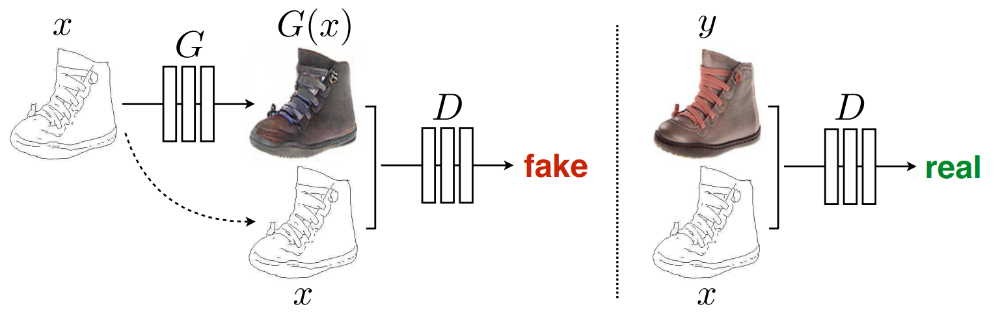

# Pix2Pix

> [Pix2Pix: Image-to-Image Translation with Conditional Adversarial Networks](https://openaccess.thecvf.com/content_cvpr_2017/html/Isola_Image-To-Image_Translation_With_CVPR_2017_paper.html)

## 简介
Pix2Pix是将GAN应用于有监督的图像到图像翻译的经典论文，有监督表示训练数据是成对的。图像到图像翻译（image-to-image translation）是GAN很重要的一个应用方向，什么叫图像到图像翻译呢？其实就是基于一张输入图像得到想要的输出图像的过程，可以看做是图像和图像之间的一种映射（mapping），我们常见的图像修复、超分辨率其实都是图像到图像翻译的例子。

## 网络结构


- 生成器（G）：U-Net
- 辨别器（D）：PatchGAN (FCN)

## 优点
- 可以解决很多“Image-to-Image translation”的一类问题
- 生成图像细节较好

## 适用领域
- 实物图像与其素描像的相互生成
- 语义分割输入与输出图像的相互生成
- 图像昼夜、四季生成
- 其他图片与图片之间的相互生成
## 参考文献
```latex
@inproceedings{isola2017image,
  title={Image-to-image translation with conditional adversarial networks},
  author={Isola, Phillip and Zhu, Jun-Yan and Zhou, Tinghui and Efros, Alexei A},
  booktitle={Proceedings of the IEEE conference on computer vision and pattern recognition},
  pages={1125--1134},
  year={2017},
  url={https://openaccess.thecvf.com/content_cvpr_2017/html/Isola_Image-To-Image_Translation_With_CVPR_2017_paper.html},
}
```