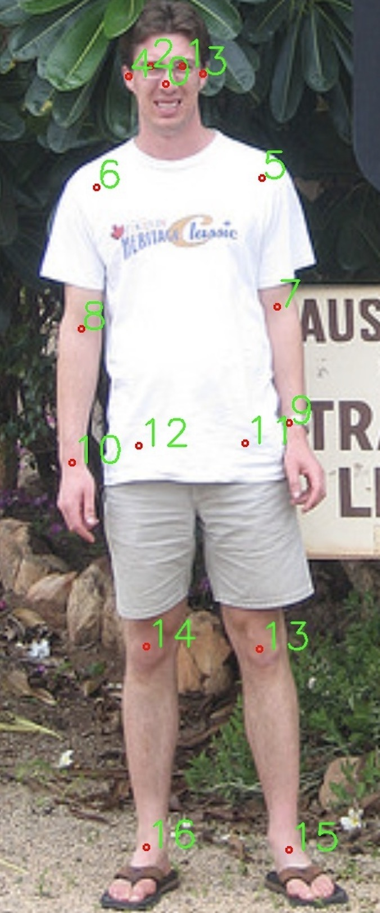

# 数据集格式
同学们需要为自己采集的数据集进行标注，即标注人所在的位置---标注框（bounding box）和每个关节点的位置，并将结果整理为如下路径格式：

    ── data
    │── coco
        │-- train.json  # 训练数据集用到的标注信息
        │-- val.json    # 评测数据集用到的标注信息
        │-- image # 存所有图像的位置
            │-- 1.jpg
            │-- 2.jpg
            │-- 3.jpg
            │-- ...
        
我们会对标注信息的存储进行规定，首先，我们需要学习关节点的标注位置和形式。

## 17个关节点标注
在实际中，关节点的定义是多样的，不同的公开数据集定义也不同，一般标注使用17个/21个/24个关节点，我们在将参照使用COCO17个关节点，作为我们的标注结果。（关于更多数据集，感兴趣的同学们可以自己探索～）
* 17个关节点具体位置和定义顺序（在计算机语言中使用索引0表示第一个）:
0：“鼻子”，1：“左眼”，2：“右眼”，3：“左耳”，4：“右耳”，5：“左肩”，6：“右肩”，7：“左肘”，8： “右肘”，9：“左手腕”，10：“右手腕”，11：“左臀”，12：“右臀”，13：“左膝盖”，14：“右膝盖”，15：“左脚踝”，16：“右脚踝” 
* 对于每个关节点，使用(x,y)的2D坐标(同检测任务标注框中xy的定义），并加入第三个维度信息用于表示是否被遮挡。
0: 不可见（完全被遮挡或图像中不存在）, 1: 被遮挡（但可以脑补出来，或者露出了一部分）, 2: 完全可见，未被遮挡 
* 如果某个关节不可见（由于拍摄超出了图像范围在图中不可见），我们使用 **(0，0，0)** 来表示这个关节点。
可参考该标注图（每个序号代表了对应关节点）：


下面，我们会详细介绍**XXX.json** 中数据格式进行介绍：
json文件存储着对应训练/评测数据集中的标注信息，用一个长度为数据集中图像个数的列表，对每一个图像记录标注信息（注意我们只对一个人进行标注）。

* "image_file"：文件路径。
* "image_size"：图像大小（长，宽）。
* "bbox"：图像中人物的标注框信息（标注框中心点横坐标x，标注框中心点纵坐标y，标注框宽w，高h）
* "keypoints"：人物的17个关节点信息，每个关节点为三维信息(x,y,遮挡信息)，因此共计51个数字。0，0，0将表示某个未显示在图中的关节。

示例：
```
[
    { # 第一张图像人的姿态数据：
        "image_file": "1.jpg",
        "image_size": [
            640,
            480
        ],
        "bbox": [
            267.03,
            104.32,
            229.19,
            320
        ],
        "keypoints": [
            0,
            0,
            0,
            325,
            160,
            2,
            ...
        ]
    },
    ...
]
```     
            
