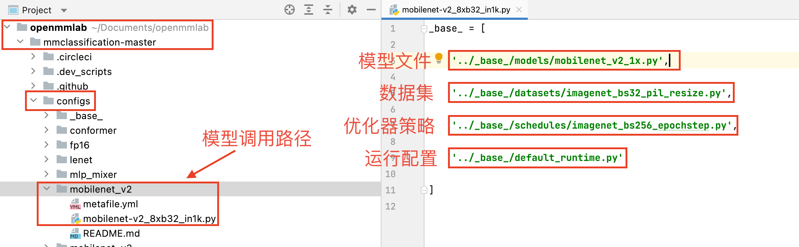
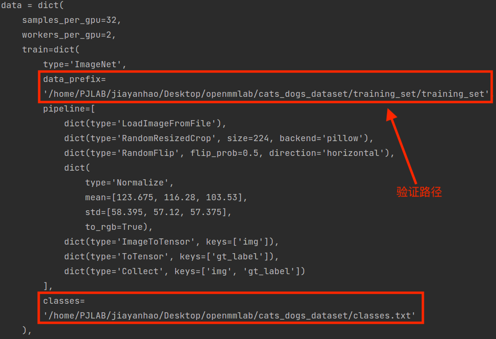
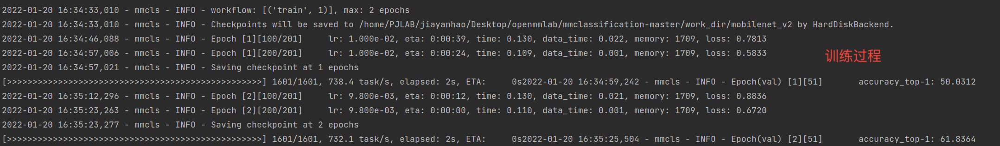

# OpenMMLab开发文档（二）之MMClassification

---

##安装教程

​	MMClassification（下文简称mmcls）是OpenMMLab系列的一个子部分，主要是帮助开发者更简洁方便地使用CV（Computer Vision，计算机视觉）方向的先进技术。

​	在使用mmcls之前，我们需要配置环境。在第一讲中我们已经配置好了Python、PyTorch和mmcv，这里略过相关信息。接着，我们从GitHub上克隆mmcls代码库并安装。

```bash
git clone http://github.com/open-mmlab/mmclassification.git
cd mmclassification/
pip install -e .
```

​	安装完成后进入python环境，输入以下代码进行测试

```python
>>import mmcls
>>print(mmcls.__version__)  #注意version前后均为两个下划线
>>0.19.0
```


## 使用MMCls预训练模型

​	MMClassification/demo下存放了示例图片，我们可以直接使用它来进行测试。

### 准备模型

​	预训练模型通过配置文件和权重参数文件来定义，配置文件定义了模型结构，权重参数文件保存了训练好的模型参数。如图所示，你所选择和使用的模型都已经预先定义好，你可以在mmclassification/configs/下查看所有可用的模型，每个模型文件夹内都存放好了该模型对应的结构、数据集、优化器策略和运行配置文件。



​	我们在安装mmcls时就已经将配置文件拿到了本地，但是我们还需要从OpenMMLab官网手动下载模型权重参数文件。方便起见我们将权重参数文件统一保存在新创建的checkpoints文件夹下并确认正确。

```bash
mkdir checkpoints
wget https://download.openmmlab.com/mmclassification/v0/mobilenet_v2/mobilenet_v2_batch256_imagenet_20200708-3b2dc3af.pth
ls configs/mobilenet_v2/mobilenet-v2_8xb32_imagenet.py
ls checkpoints/mobilenet_v2_batch256_imagenet_20200708-3b2dc3af.pth
```


### 构建模型

​	我们在jupyter notebook中进行第一个模型的构建，首先打开terminal，输入ipython notebook，并新建一个ipy文件。


​	在终端编写代码：

```python
from mmcls.apis import inference_model, init_model, show_result_pyplot

config_file = 'configs/mobilenet_v2/mobilenet_v2_b32x8_imagenet.py'
checkpoint_file = 'checkpoints/mobilenet_v2_batch256_imagenet_20200708-3b2dc3af.pth'

#如果你的电脑有gpu，则 device = 'cuda:0'，否则使用cpu计算
device = 'cpu'

model = init_model(config_file, checkpoint_file, device = device)
```


接着展示示例图像的分类结果

```python
img = 'demo/banana.png'

import mmcv

img_array = mmcv.imread(img)
result = inference_model(model, img_array)

#show_result_pyplot(model, img, result) 你也可以使用该语句可视化结果
```


## 使用MMCls_tools训练自己的模型

### 下载数据集

​	这里以猫狗分类数据集作示例，首先需要从OpenMMLab网盘上下载数据集并解压。

```bash
wget https://www.dropbox.com/s/wml49yrtdo53mie/cats_dogs_dataset_reorg.zip?dl=0 -O cats_dogs_dataset.zip
mkdir data
unzip -q cats_dogs_dataset.zip -d ./data/
```

​	目录如下图，test_set包括了测试用数据，training_set包含了训练用数据，val_set包含了验证用数据，classes.txt中声明了猫和狗两个不同的类别，test.txt和val.txt中包含着数据集的正确答案。

​	你也可以自己创建新的数据集并使用mmcls进行训练，需要注意的是**新的数据集格式必须将图像和标签放在同级目录下**，最简单的就是转换成现有的ImageNet格式（ImageNet是斯坦福大学提出的一个用于视觉对象识别软件研究的大型可视化数据库，目前大部分模型的性能基准测试都在ImageNet上完成）。


### 修改配置文件

​	为了能够复用不同配置文件中的常用部分，mmcls支持多配置文件继承，下面我们就基于原先的mobilenet来自定义一个配置文件，这是一个轻量化的CNN网络，参数少，网络结构简单，训练速度快，是很适合新手入门的网络之一。

​	在mmclassification/configs/mobilenet_v2/下新建属于自己的模型文件，命名为mobilenet-v2_8xb32_cats_dogs.py，内容修改如下：


### 训练模型

​	我们使用mmcls下的tools进行模型微调，在terminal中输入：

`python tools/train.py \ configs/mobilenet_v2/mobilenet-v2_8xb32_cats_dogs.py \ --work-dir work-dir/mobilenet-v2_8xb32_cats_dogs`

​	训练开始后，你可以在输出中看到自己训练的全部流程和各种信息








### 测试模型

​	训练完成后，我们同样使用已封装好的test.py进行模型的测试，在terminal中输入：

`python tools/test.py configs/mobilenet_v2/mobilenet-v2_8xb32_cats_dogs.py work_dir/mobilenet-v2_8xb32_cats_dogs/latest.pth --metrics=accuracy --metric-options=topk=1 `

​	同样在测试程序结束后，数据会生成并保存在对应的目录下，因为是二分类问题所以是以分类准确率作为性能指标来反应模型的质量。


### 推理计算

​	输入命令：

`python tools/test.py configs/mobilenet_v2/mobilenet-v2_8xb32_cats_dogs.py work_dir/mobilenet-v2_8xb32_cats_dogs/latest.pth --out=result.json`

​	最终在你的MMClassification文件下会生成你的模型对你的测试集运行得出的推理结果，你也可以将模型文件、权重文件和测试代码移植到其它具有相同代码环境的机器上进行使用。


​	结果保存成功，第一个分类任务圆满完成🎉🎉🎉！

## 结语

​	至此，mmcls的预训练和自主训练模型的全部教学就结束了。相对于TensorFlow、PyTorch等深度学习框架，OpenMMLab的封装更高效简洁，非常适合用于教学任务、敏捷开发、迁移开发和新手入门等方面，希望我们的努力可以帮助你更好地接触AI、使用AI、创造AI。

